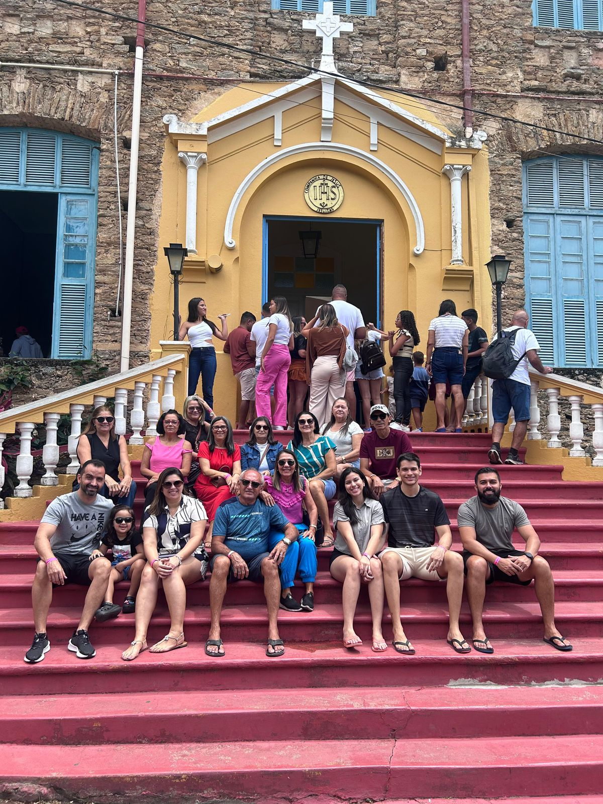
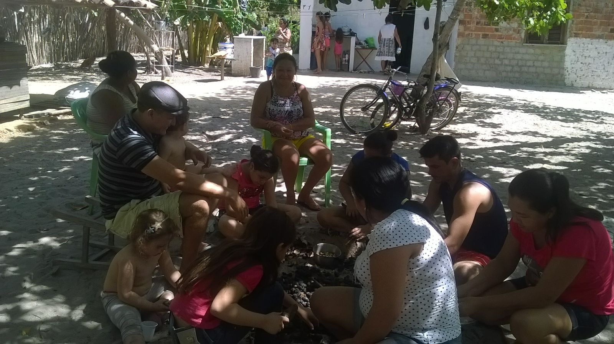
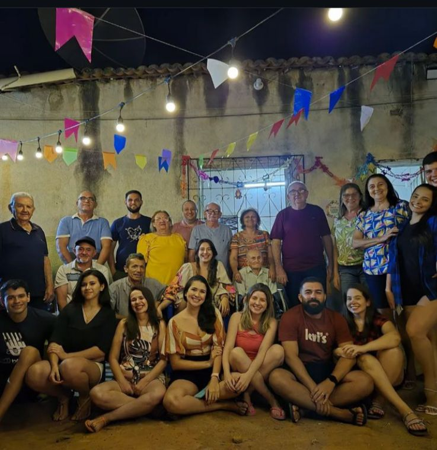
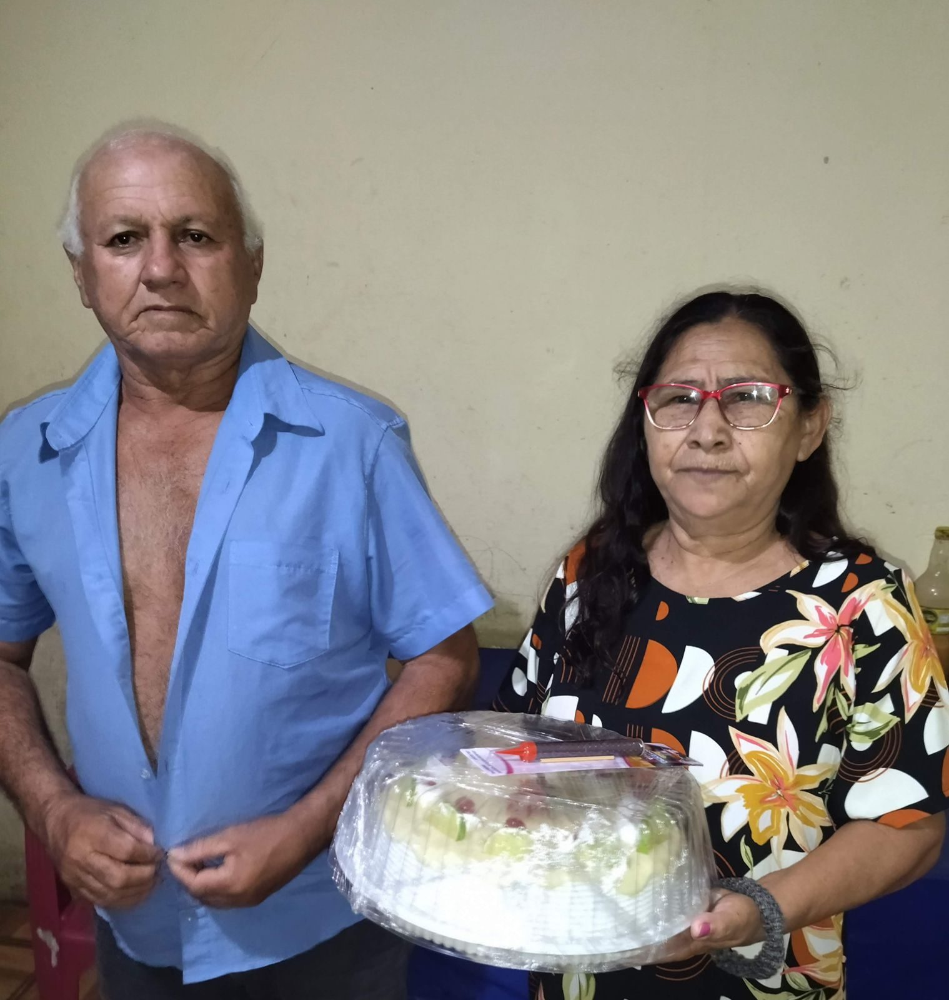
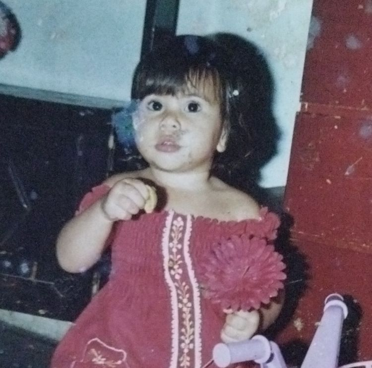
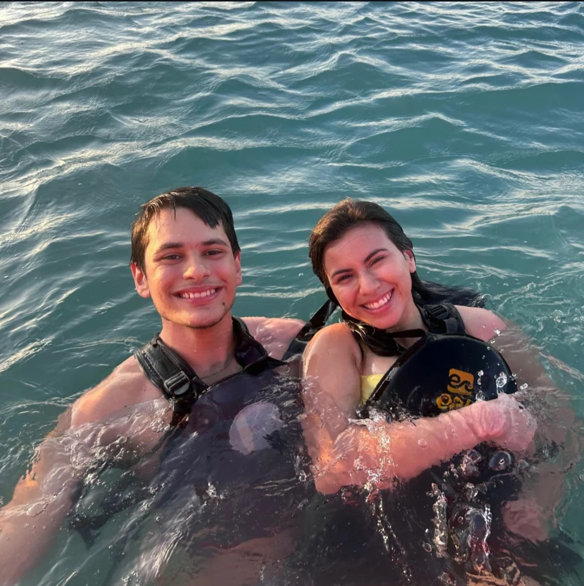
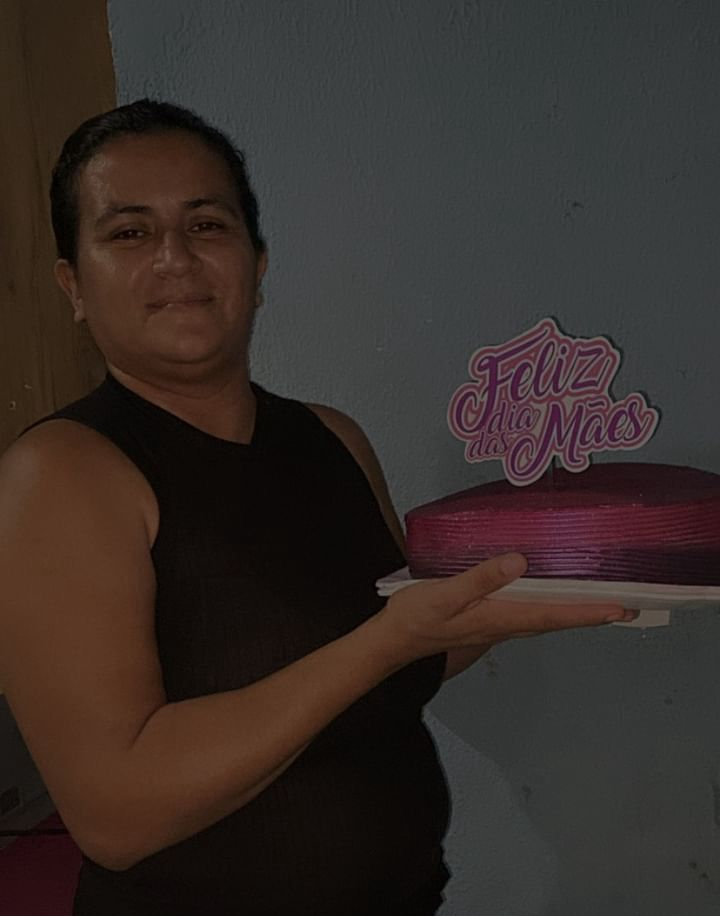

# Minibiografia - Keliane Soares

**Desafio de Código FWK** | Site pessoal interativo com design moderno

---

## 📋 Sobre o Projeto

Este projeto foi desenvolvido como **desafio de código da FWK**, tendo como objetivo criar uma minibiografia interativa e visualmente atraente. O site apresenta minha trajetória pessoal, momentos importantes com a família e uma galeria de fotos especiais.

### 🎯 Objetivo do Desafio

Criar uma página web responsiva e moderna que conte minha história pessoal de forma criativa, utilizando HTML, CSS e JavaScript puros.

---

## ✨ Funcionalidades

### 📝 Seção "Sobre Mim"
- Biografia detalhada com informações pessoais
- Foto de perfil com animação flutuante
- Post-it decorativo com mensagem inspiradora
- Figurinhas animadas (☕ ✈️ 📖)
- Design com gradientes e sombras modernas

### 📸 Galeria de Momentos Especiais

| Goiás | Guaramiranga | Família |
|:---:|:---:|:---:|
|  |  |  |
| Infância em Goiás | Natureza e paz | Meu pequeno amor |

| Piauí | Mombaça | Avós |
|:---:|:---:|:---:|
|  |  |  |
| Conhecendo raízes | Tradições | Meus avós |

| Casa da Vó | Praia | Dia das Mães |
|:---:|:---:|:---:|
|  |  |  |
| Antes das viagens | Pôr do sol | Celebração |

- Grid responsivo com 9 fotos
- Efeitos hover com elevação e zoom
- Legendas descritivas para cada momento
- Animações de entrada escalonadas

### 💬 Modal de Contato
- Botão interativo "Entrar em Contato"
- Modal com animação slide-up
- Links diretos para: E-mail, LinkedIn e GitHub
- Botão fechar com animação de rotação

---

## 📄 Licença

Este projeto foi desenvolvido como parte de um desafio de código da **FWK** e está disponível sob a licença MIT.

---

**Desafio FWK 2025**

