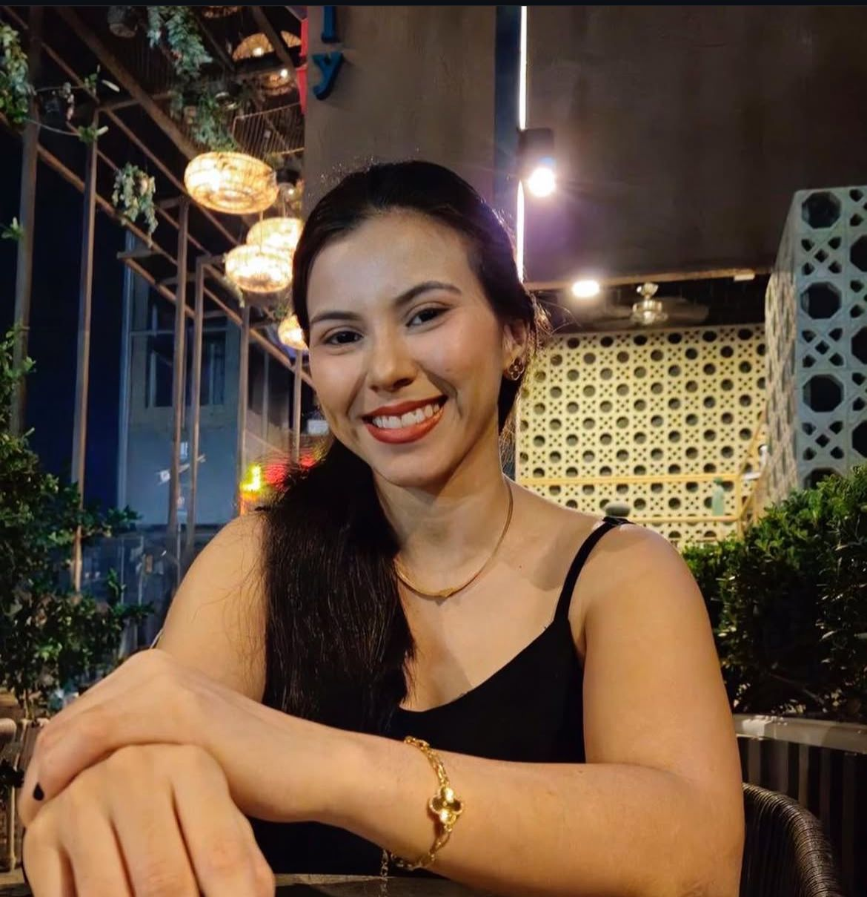
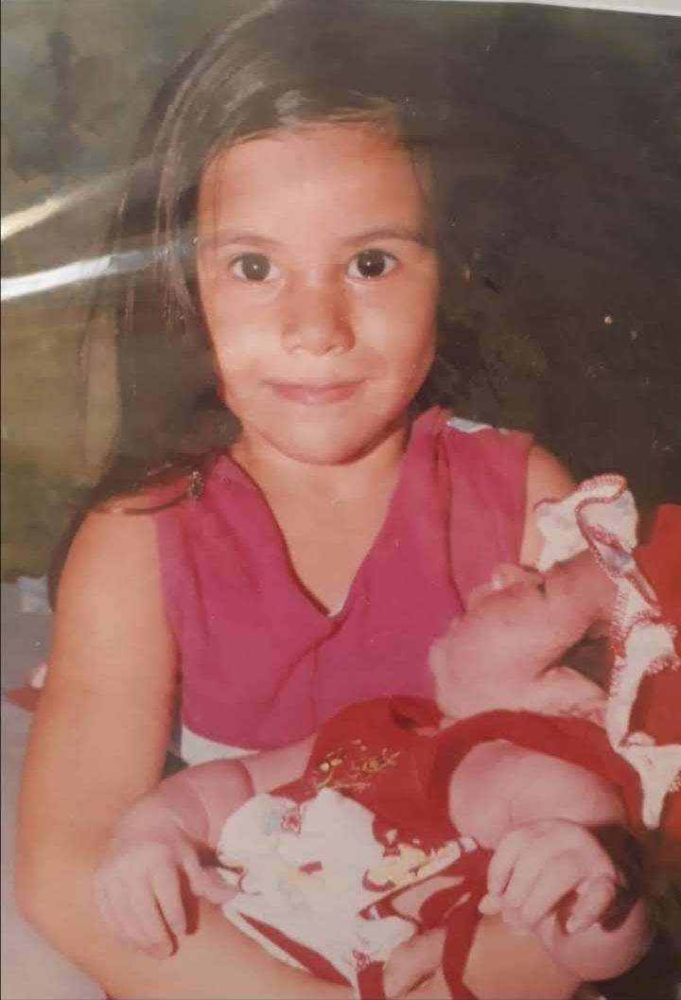

# Minibiografia - Keliane Soares

<div align="center">



**Desafio de Código FWK** | Site pessoal interativo com design moderno

</div>

---

## 📋 Sobre o Projeto

Este projeto foi desenvolvido como **desafio de código da FWK**, tendo como objetivo criar uma minibiografia interativa e visualmente atraente. O site apresenta minha trajetória pessoal, momentos importantes com a família e uma galeria de fotos especiais.

### 🎯 Objetivo do Desafio

Criar uma página web responsiva e moderna que conte minha história pessoal de forma criativa, utilizando HTML, CSS e JavaScript puros.

---

## ✨ Funcionalidades

### 📝 Seção "Sobre Mim"
- Biografia detalhada com informações pessoais
- Foto de perfil com animação flutuante
- Post-it decorativo com mensagem inspiradora
- Figurinhas animadas (☕ ✈️ 📖)
- Design com gradientes e sombras modernas

### 📸 Galeria de Momentos Especiais

<div align="center">

| Goiás | Guaramiranga | Família |
|:---:|:---:|:---:|
|  |  |  |
| Infância em Goiás | Natureza e paz | Meu pequeno amor |

| Piauí | Mombaça | Avós |
|:---:|:---:|:---:|
|  |  |  |
| Conhecendo raízes | Tradições | Meus avós |

| Casa da Vó | Praia | Dia das Mães |
|:---:|:---:|:---:|
|  |  |  |
| Antes das viagens | Pôr do sol | Celebração |

</div>

- Grid responsivo com 9 fotos
- Efeitos hover com elevação e zoom
- Legendas descritivas para cada momento
- Animações de entrada escalonadas

### 💬 Modal de Contato
- Botão interativo "Entrar em Contato"
- Modal com animação slide-up
- Links diretos para: E-mail, LinkedIn e GitHub
- Botão fechar com animação de rotação

---

## 🎨 Design & Estilo

### Paleta de Cores
```css
🎨 Primária: #d4a574 (Dourado)
🎨 Secundária: #f5e6d3 (Bege Claro)
🎨 Destaque: #c89666 (Bronze)
🎨 Escura: #5a4a3a (Marrom)
🎨 Clara: #fdfbf7 (Off-white)
```

### Características Visuais
- ✨ Gradientes suaves e harmoniosos
- 🌟 Animações CSS (float, bounce, fade, slide)
- 🔮 Glassmorphism (backdrop-filter blur)
- 💫 Sombras multicamadas profissionais
- 🎭 Transições cubic-bezier suaves
- 📱 Design 100% responsivo

---

## 🛠️ Tecnologias Utilizadas

| Tecnologia | Uso |
|:---|:---|
| **HTML5** | Estrutura semântica e acessível |
| **CSS3** | Estilização avançada com animações |
| **JavaScript** | Interatividade do modal |
| **Google Fonts** | Fonte Pacifico (cursiva elegante) |

---

## 🚀 Como Executar Localmente

### Opção 1: Abertura Direta
```bash
# Navegue até a pasta e abra o arquivo
index.html
```

### Opção 2: Servidor Local (Recomendado)
```bash
# Clone ou baixe o repositório
cd Minibiografia

# Inicie um servidor HTTP simples
# Python 3:
python -m http.server 8000

# Node.js (http-server):
npx http-server -p 8000

# Acesse no navegador:
http://localhost:8000
```

---

## 📁 Estrutura do Projeto

```
Minibiografia/
│
├── index.html          # Página principal
├── style.css           # Estilos e animações
├── script.js           # Interatividade
├── README.md           # Documentação
│
└── assets/             # Galeria de imagens
    ├── eu.jpg
    ├── goias.jpg
    ├── guaramiranga.jpg
    ├── irmão.png
    ├── piaui.jpg
    ├── mombaça.jpg
    ├── casa-vó.jpg
    ├── aproveitando-o-mar.jpg
    ├── vó-e-vô.jpg
    └── dia-das-maes.jpg
```

---

## 🎓 Aprendizados do Desafio

Durante o desenvolvimento deste projeto para o desafio FWK, foram aplicados:

- ✅ **CSS Grid** para layout responsivo da galeria
- ✅ **Flexbox** para alinhamento e distribuição de elementos
- ✅ **Animações CSS** avançadas (@keyframes)
- ✅ **Gradientes lineares e radiais** para efeitos visuais
- ✅ **Modal JavaScript** sem frameworks
- ✅ **Design responsivo** com media queries
- ✅ **Acessibilidade** (ARIA labels, semântica HTML)
- ✅ **Boas práticas** de código limpo e organizado

---

## 📱 Responsividade

O site se adapta perfeitamente a diferentes tamanhos de tela:

- 💻 **Desktop** (> 768px): Layout em 3 colunas
- 📱 **Tablet** (768px): Layout em 2 colunas
- 📱 **Mobile** (< 480px): Layout em 1 coluna

---

## 🌐 Deploy

Este projeto pode ser facilmente hospedado em:
- **GitHub Pages**
- **Vercel**
- **Netlify**
- Qualquer servidor web estático

---

## 👤 Autora

**Keliane Soares**
- 💼 Desenvolvedora Back-end
- 📍 Maracanaú, CE
- 📧 [E-mail](mailto:keliane@email.com)
- 💼 [LinkedIn](https://www.linkedin.com/in/keliz)
- 🐙 [GitHub](https://github.com/kelidss)

---

## 📄 Licença

Este projeto foi desenvolvido como parte de um desafio de código da **FWK** e está disponível sob a licença MIT.

---

<div align="center">

**Feito com 💖 por Keliane Soares | Desafio FWK 2025**

⭐ Se gostou do projeto, deixe uma estrela!

</div>
